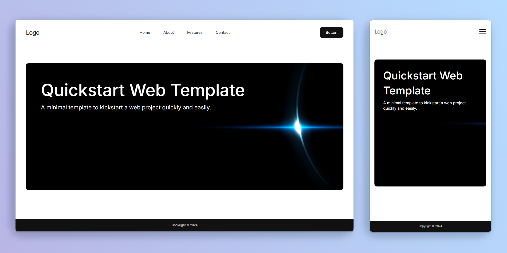

# Quickstart Web Template



## Description

The **Quickstart Web Template** is a minimal web template designed for simple or mini web projects, and landing pages. It provides a clean, organized front-end setup with an SCSS structure, reusable components, and basic JavaScript functions for common web interactions. Perfect for quickly starting a web project without the hassle of setting up from scratch.

## Prerequisites

- Basic knowledge of HTML, SCSS and JavaScript.

## Features

- **Organized HTML and SCSS Structure**: Easily maintainable folder setup with separate sections for reusable elements and common styles.
- **Pre-designed Components**: Includes buttons, burger menu, section-specific and global styles (variables, mixins, reset).
- **Basic JavaScript for Interactivity**: Scripts for a fixed navbar, mobile navigation, and scroll-to-top button.
- **No packages and build tools**: Just essentials to get started.

## Getting Started

To use this template, follow the steps below.

### Installation

1. **Clone the Repository**: 
    ```bash
    git clone https://github.com/hhlitval/quickstart-web-template.git
    ```
2. **You need to have a SCSS compiler installed if you want to compile SCSS to CSS (e.g. Live Sass Compiler Extension for VS Code)**
3. **Start working** - Begin modifying the template.

## License

This project is licensed under the [MIT License](LICENSE).
